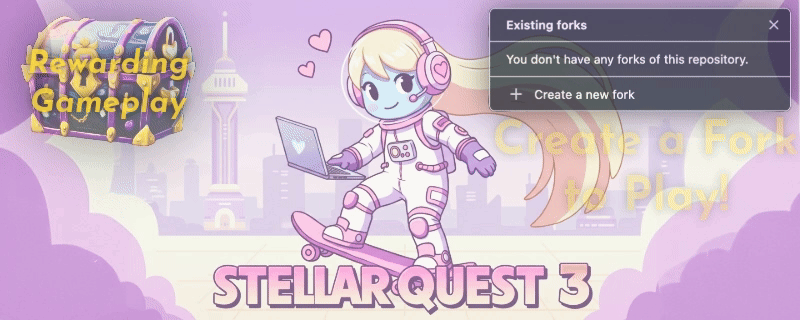
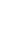
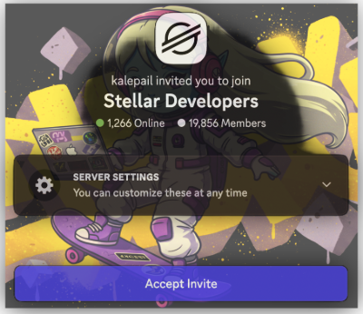

 <!-- omit in toc -->

<div style="text-align: center;" align="center">
<h1>🚀 Stellar Quest 3 🚀</h1>
</div>

----

<div align="center">
  
</div>

----

<div style="display: flex; justify-content: center; align-items: center; gap: 20px; padding: 15px; margin: 10px 0;">
  <h3>Skills Acquired</h3>
</div>
<div style="display: flex; justify-content: center; align-items: center; gap: 20px; padding: 15px; margin: 10px 0;">
<span style="display: flex; align-items: center;">⭐️ </span>
<span style="display: flex; align-items: center;">⭐️ </span>
<span style="display: flex; align-items: center;">⭐️ </span>
<span style="display: flex; align-items: center;">⭐️ </span>
<span style="display: flex; align-items: center;">⭐️ </span>
<span style="display: flex; align-items: center;">⭐️ </span>
</div>


----


<div style="text-align: center;" align="center">
<strong>💻 **Devcontainers on Demand**  💻</strong>
</div><br/>

<div align="center">
<a href="https://github.com/codespaces/new?repo=anataliocs/soroban-quest">
  
</a>
</div><br/>
<div align="center">
<a href="https://app.codeanywhere.com/#https://github.com/anataliocs/soroban-quest">
  
</a>
<a href="https://codesandbox.io/s/github/anataliocs/soroban-quest">
  
</a>
</div><br/>

<div align="center">
<a href="https://github.com/anataliocs/soroban-quest/fork">
  
</a>
</div>

<hr/>

## 🌟 Introduction 🌟

Welcome to the **Stellar Quest 3** preview! We are building an immersive approach to learning and practicing
Stellar Smart Contract development. While isolated web tutorials are great we are trying to do something a bit more.
Stellar Quest 3 brings **real-world developer environments** directly to
your laptop on-demand, streamling onboarding and making your developer experience a bit more **gamified, engaging,
and fun** 🔥.

#### 🏆**Preview of Proof of Completion Cert:**<br/>

<a href="https://anataliocs.github.io/soroban-quest/">
  
</a>

## ✨ Why be Excited for Stellar Quest 3? ✨

- 🌍 **Devcontainers:** OSS technology that lets you spin up highly customized environments
  effortlessly on GitHub Codespaces and other popular platforms
- 💻 **Code Anywhere, Instantly:** Connect seamlessly using your local VS Code IDE or directly access your
  environment from a browser
- 🎨 **Customized & Lovingly Crafted:** Jump into a fully blinged out setup, complete with a customized
  terminal and IDE, tuned for productivity and prettiness
- 🖥️ **Built-in Browser:** Light desktop integration grants access to Firefox in your execution environment
  which facilitates workflows and web integrations directly from your devcontainer
- 🧩 **Passkeys:** Seamlessly leverage stellar wallet browser plugins like such as xBull, or create Passkey
  wallets using the open-source Bitwarden password manager
- 🔑 **Secure:** Secure OAuth2 integrations with Github and Discord and VPN and SSH for privacy and security

## 🚦 What's Coming with Stellar Quest 3? 🚦

A refreshed and updated developer experience delivers a more guided, curated learning experience that connects with
your actual workflow, building expertise with actual dev tools while you learn to code Stellar Smart Contracts.

#### Highlights include:

- 📘 **Interactive IDE-Based Learning:** Test your knowledge directly with quizes built into the IDE through VS Code
  tasks
- ✅ **Guided Learning:** Clearly structured, modified TODO task trees, lead you step by step through each contract.
- 🛠️ **Automated Feedback:** GitHub Actions verify your knowledge with automatically evaluated quizzes and coding tasks,
  ensuring a transparent and streamlined learning progression.
- 🧪 **Realistic Coding Challenges:** Gain practical skills by writing actual testable code that passes CI/CD
  pipelines and quality gates like a real-world project!

--

## 🛠️ Development Commands & Tips 🛠️

Here's a quick-reference toolset to streamline your development journey:

### 📋 Codespaces Interaction:

- **Create and manage Codespaces easily via CLI**:

``` bash
# List current Codespaces
gh codespace list

# Create a new Codespace
gh codespace create --repo anataliocs/soroban-quest -b main --status --web -l WestUs2

# Delete all Codespaces (confirmation auto-approved)
echo 'Y' | gh codespace delete --all --force
```

- **Gain SSH Access & Stream logs**:

``` bash
gh codespace ssh
gh codespace logs
```

### 📖 Quick Note-taking with DNote CLI:

Document as you go conveniently and rapidly:

- [DNote CLI - Commands](https://github.com/dnote/dnote/wiki/Dnote-CLI#commands)

## 🤝 Join Our Community 🤝

Need further assistance, exciting challenges, or simply want to fly further in your Stellar Quest? Join the vibrant
community of Stellar developers, creators, and enthusiasts:
👉 [Join the Stellar Developers Discord](https://discord.gg/stellardev)



--

📣 **Ready to Start Your Stellar Journey?**
Make Stellar Quest 3 Your Gateway to Innovation, Growth, and Professional Development! 🚀✨

----

#### Secondary Devcontainer Providers

These aren't our first choice for dev ex but if you already use the tools then here you go:

<a href="https://coder.com/deploy">
  
</a>
