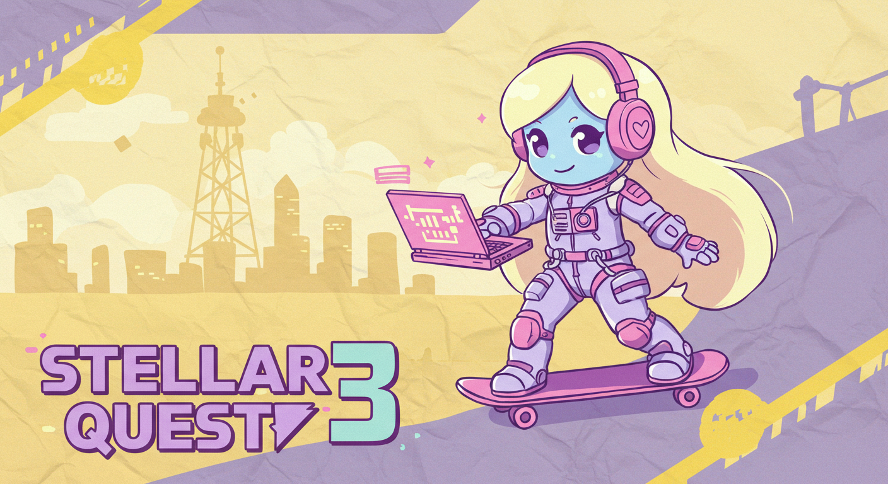

# Stellar Quest 3 <!-- omit in toc -->

<div style="text-align: center;" align="center">

</div>

## Stellar Quest 3 Preview

- Devcontainers are a relatively new OSS tech that let you spin up a customized dev environment on Codespaces or many
  other platforms
- You can connect your local VS Code IDE to the Dev Env or access it in a browser
- Fully featured dev env with customized and blinged out terminal and IDE
- Integrated light desktop gives you access to a Firefox browser and GUI file mgmt system
- This gives you access to Wallet add-ons like xBull
- You can also create a Passkeys wallet with the OSS Free-Forever password mgmt app BitWarden
- Users are authenticated via Github and Discord via OAuth
- The DX will be a more guided, curated and gamified experience designed to be more engaging and fun

[](https://github.com/codespaces/new?repo=anataliocs/soroban-quest)

[](https://app.codeanywhere.com/#https://github.com/anataliocs/soroban-quest)

## Table of Contents <!-- omit in toc -->

## Welcome

To a whole new updated ~~Soroban Quest~~ Stellar Quest 3!

It's a faster, more curated, guided developer journey through Stellar Smart Contracts.

Instead of being web app based, we directly use the dev tools that you will use during development during the
learning process.

- Quizzes are directly integrated into your IDE using VS Code hooks
- Learning tasks are implemented through a tree of modified TODOs
- Grading quizzes occurs via Github actions
- Code challenges involve learning through the normal workflow of:
    - Making sure the tests run correctly
    - Making sure you pass security gates in the build process for security, code quality and coding style

--

Stream logs

```
gh codespace logs
```

OAuth CLI

```
oauth2c https://discord.com \
  --client-id \
  --client-secret  \
  --response-types code \
  --response-mode query \
  --grant-type authorization_code \
  --auth-method client_secret_basic \
  --scopes identity \
  --redirect-url https://fluffy-sniffle-5rj7v4pv97f4qwq-20241.app.github.dev:20241 \
  --callback-tls-cert https://raw.githubusercontent.com/cloudentity/oauth2c/master/data/cert.pem \
  --callback-tls-key https://raw.githubusercontent.com/cloudentity/oauth2c/master/data/key.pem
```

DNote

```
https://github.com/dnote/dnote/wiki/Dnote-CLI#commands
```

Launch Codespace from Github CLI

```

gh codespace list

gh codespace create --repo anataliocs/soroban-quest -b main --status --web -l WestUs2

echo 'Y' | gh codespace delete --all --force

```

GH Codespaces Remote Terminal

```
gh codespace ssh
gh codespaces logs
```

[dev-discord]: https://discord.gg/stellardev
