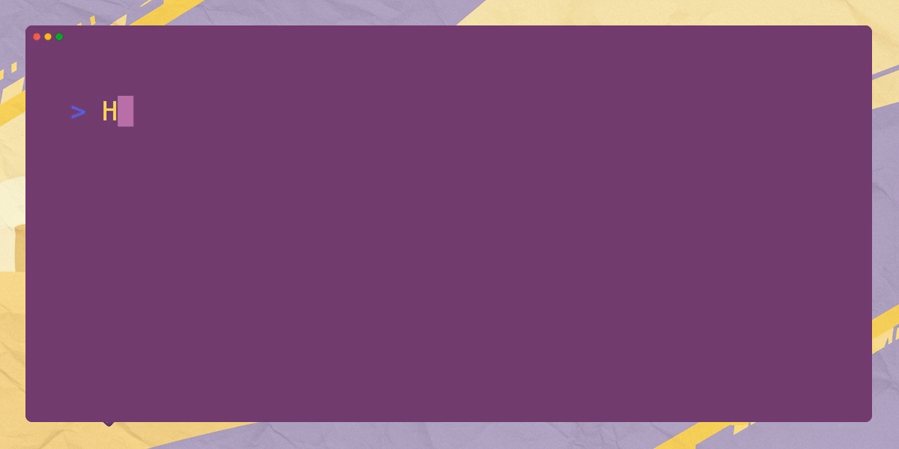

> "Ah! You've arrived!  Splendid!  
> Here's your cloud... thing-or-other. Cosy, innit?"
> "Spit-spot now!  No time to muck about.

> Dawdling won't make these contracts
> frightfully smarter.
> "Right then, let's get settled shall we?"
> "Try not to cause a fuss."
>
> - Sir Nigel Reginald, Synthetic Fabricant 🇬🇧💷🍻
> - Your very droll, dry-witted robotic chaperone and assistant 🤖

## First Steps: Diagnostics on Devcontainer environment:

### 📋 QC Check 1:  Devcontainer Startup

```
<> Quality-Gate-1:  Did the Devcontainer Startup correctly?
```

**Find build log:**

- Open your VS Code Command Palette with `CMD+SHIFT+P`
- Search for the option "Devcontainers:  Show Container Log"
    - Alternatively, the VSCode Command is called `@command:remote-containers.revealLogTerminal`
    - You can also use the env var `$BUILD_LOG_FILE` to
      find the devcontainer build log at(Substitute your workspace):
      `/workspaces/soroban-quest/log/devcontainer/devcontainer_build.log`

**Search Build Log:**

- Use `CMD+F` to search the startup logs for an `Exit code 1` an `Error` or a `Command Failed`

#### QC Check 1: Sadface 😭

**Try Basic Remediations:**

- If there's an error:
    - `CMD+SHIFT+P` -> Command Palette(CP) -> Search for "Devcontainers: Rebuild Container"
    - Or the Command:  `@command:remote-containers.rebuildContainer`
    - Check your branch and your repo
    - If the error persists, reach out on Discord or open a GitHub Issue

#### QC Check 1: Startup ✅

**Happy Path:**

- No errors and happy logs? 🙌

Example happy logs:

```
 ✅ postStartCliAutocomplete.sh executed successfully
2025-04-09 09:39:56.668Z: Outcome: success User: vscode WorkspaceFolder: /workspaces/soroban-examples
2025-04-09 09:39:56.673Z: devcontainer process exited with exit code 0
```

**Find Codespace Name:**

- Get the codespace name from the URL:  "https://[refactored-enigma-j7vpr4w46w35999].github.dev/"
    - It will be in the form of a host triple such as: `refactored-enigma-j7vpr4w46w35999`
    - Or you can find it with the env var `$CODESPACE_NAME`

**Verify Codespace:**

```
<> ✨STARDUST✨ - Completing this tasks can potentially award Stardust and sq3-xp
```

- After you get your Codespace name let's verify and register it
- `CMD+SHIFT+P` -> Command Palette(CP) -> Search for "Tasks: Run Tasks"
    - It will also be a command named: `@command:workbench.action.tasks.runTask`
    - Find the task named "QC - Quality-Gate-1:  Did the Devcontainer Startup correctly?"
        - Execute the task and enter your Codespace name when prompted then submit

```
<> HAPPY_PATH_CHECKPOINT 1 ☑️
```

----

![intro-0+1.gif](intro-0%2B1.gif

### Stellar 💫 **Quest[3]** 🌟

⚡️A -> _Fun_ and 💕**engaging:** Romp 💃through
✨Stellar **`Smart Contract` 💻 _Development_

----

"Settled in your cloud? Splendid. Now, about these rather tedious 'smart contracts'.
Best not dawdle, the shiny bits won't distribute themselves."

Now, these 'smart contracts'. Do try your best. Important glittery things depend on
it."
