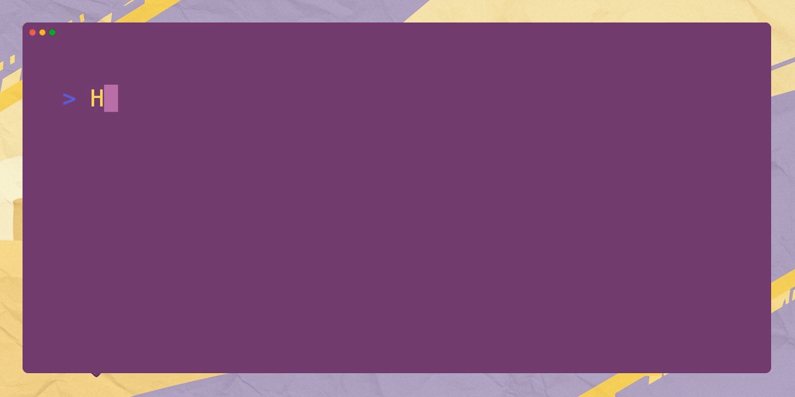

> _"Ah! You've arrived!  Splendid!"_
>
> _"Here's your cloud... thing-or-other. Cosy, innit?"_
>
> _"Spit-spot now!  No time to muck about."_
>
> _"Dawdling won't make these contracts frightfully smarter."_
>
> _"Right then, let's get settled shall we?"_
> _"Try not to cause a fuss..."_
>
> - **Sir Nigel "X-23" Reginald(Synthetic Fabricant), the 42nd 🇬🇧 💷 🍻**
> - _Your very droll, dry-witted robotic chaperone and assistant 🤖_
>
> 

## First Steps: Diagnostics on Devcontainer environment

----

### 📋 QC Check 1:  Devcontainer Startup

```
<> Quality-Gate-1:  Did the Devcontainer Startup correctly?
```

**Find build log:**

- Open your VS Code Command Palette with `CMD+SHIFT+P`
- Search for the option "Devcontainers:  Show Container Log"
	- Alternatively, the VSCode Command is called `@command:remote-containers.revealLogTerminal`
	- You can also use the env var `$BUILD_LOG_FILE` to
	  find the devcontainer build log at(Substitute your workspace):
	  `/workspaces/soroban-quest/log/devcontainer/devcontainer_build.log`

**Search Build Log:**

- Use `CMD+F` to search the startup logs for an `Exit code 1` an `Error` or a `Command Failed`

#### QC Check 1: Sadface 😭

**Try Basic Remediations:**

- If there's an error:
	- `CMD+SHIFT+P` -> Command Palette(CP) -> Search for "Devcontainers: Rebuild Container"
	- Or the Command:  `@command:remote-containers.rebuildContainer`
	- Check your branch and your repo
	- If the error persists, reach out on Discord or open a GitHub Issue

#### QC Check 1: Startup ✅

**Happy Path:**

- No errors and happy logs? 🙌

Example happy logs:

```
 ✅ postStartCliAutocomplete.sh executed successfully
2025-04-09 09:39:56.668Z: Outcome: success User: vscode WorkspaceFolder: /workspaces/soroban-examples
2025-04-09 09:39:56.673Z: devcontainer process exited with exit code 0
```

**Find Codespace Name:**

- Get the codespace name from the URL:  "https://[refactored-enigma-j7vpr4w46w35999].github.dev/"
	- It will be in the form of a host triple such as: `refactored-enigma-j7vpr4w46w35999`
	- Or you can find it with the env var `$CODESPACE_NAME`

**Verify Codespace:**

```
<> ✨STARDUST✨ - Completing this tasks can potentially award Stardust and sq3-xp
```

- After you get your Codespace name, let's verify and register it
- `CMD+SHIFT+P` -> Command Palette(CP) -> Search for "Tasks: Run Tasks"
	- It will also be a command named: `@command:workbench.action.tasks.runTask`
	- Find the task named "QC - Quality-Gate-1:  Did the Devcontainer Startup correctly?"
		- Execute the task and enter your Codespace name when prompted then submit

```
<> HAPPY_PATH_CHECKPOINT_1 ☑️ 
```

----

![intro-0-[12].gif](intro-0-%5B12%5D.gif)

> _"Settled in your dev-cloud-receptacle? Splendid."_
>
> _"Certainly I suppose more quality gates are a notch above_
> _another interdimensional portal in the larder. Right then."_
>
> - **Sir Nigel "X-23" Reginald(Synthetic Fabricant), the 42nd 🇬🇧 💷 🍻**
> - _Your very droll, dry-witted robotic chaperone and assistant 🤖_
>
> 

### Stellar 💫 **Quest[3]** 🌟

⚡️A -> _Fun_ and 💕**engaging:** Romp 💃through
✨Stellar **`Smart Contract` 💻 _Development_

----

### 📋 QC Check 2:  Devtools are configured

```
<> Quality-Gate-2:  Did the Stellar CLI get Setup Correctly?
```

**Check Stellar CLI:**

- Open up both a bash and zsh terminal -> This can be done via:
	- `CMD+SHIFT+P` -> Command Palette(CP) -> "Terminal: Create New Terminal"
	  Or with the command:  `@command:workbench.action.terminal.new`
	- The terminal window also has a "+" to create new terminal windows

- Run the command `stellar --version` in both terminals
- Ensure you have the latest version as per:  https://github.com/stellar/stellar-cli/releases/

**Check Stellar CLI autocomplete:**

- If autocomplete isn't working in either terminal, you can set it up like this:

```bash
echo "source <(stellar completion --shell bash)" >> ~/.bashrc
echo "source <(stellar completion --shell zsh)" >> ~/.zshrc
```

**Check Rustup and sccache:**

- Run `rustup --version` in both terminals and verify
	- At least 1.81
- Check `sccache` as well -> `sccache --show-stats`
	- Ensure stats are at least non-zero

#### QC Check 2:  Devtools are configured ✅

**Happy Path:**

- Everything is configured correctly

**Verify Config:**

```
<> ✨STARDUST✨ - Completing this tasks can potentially award Stardust and sq3-xp
```

- After you get your
- `CMD+SHIFT+P` -> Command Palette(CP) -> Search for "Tasks: Run Tasks"
	- It will also be a command named: `@command:workbench.action.tasks.runTask`
	- Find the task named "QC - Quality-Gate-2:  ?"
		- Execute the task

```
<> HAPPY_PATH_CHECKPOINT_2 ☑️
```

---


![intro-0-[345].gif](intro-0-%5B345%5D.gif)

> _"If I might interject, there is chatter of space glitter"_
>
> _"Jolly good show, another interdimensional bull market."_
>
> _"Though I must say, this universe's milk supply is disappointingly warm,
> and it's meme coin markets are at absolute zero."_
>
>
> - **Sir Nigel "X-23" Reginald(Synthetic Fabricant), the 42nd 🇬🇧 💷 🍻**
> - _Your very droll, dry-witted robotic chaperone and assistant 🤖_
>
> 

### Less Rusty then Nigel

<style>
.svg:hover {
  filter: invert(5%) sepia(5%) saturate(100%) hue-rotate(180deg) brightness(100%) contrast(100%);
  cursor: pointer;
}
</style>

<a class="svg" href="https://anataliocs.github.io/Stellar-Quest-3-Jekyll/about/" >

</a><br/>

Github actions can drop off treasures in your Github Pages deployment. Click this link to check out the Treasure
Chest.

----

### 📋 QC Check 3:  Contract Operations

```
<> Quality-Gate-3:  Contract Operations
```

Now let's build,test deploy and invoke a smart contract.

----

**Check PATH:**

- Search

----


> _"Rather a predicament, isn't it?"  Stuck in a time loop with merge conflicts."_
>
> _"One simply cannot have a proper space adventure without at_
> _least one degen rogue toaster. It appears this reality is no exception."_
>
> _"And they expect me to audit this multi-galaxy decentralized GIF protocol?_
> _Good heavens, the very concept is preposterous."_
>
> - **Sir Nigel "X-23" Reginald(Synthetic Fabricant), the 42nd 🇬🇧 💷 🍻**
> - _Your very droll, dry-witted robotic chaperone and assistant 🤖_
>
> 

### 📋 QC Check 4:  Knowledge

```
<> Quality-Gate-4:  Contract Operations
```

Now let's


----


----

**Congrats on completing the tutorial!!! 👏 🎉**


